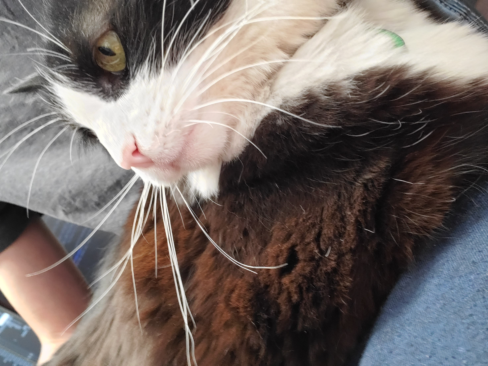

# JapanColorado

## Who I am

Hi! I'm Russell, also known as _JapanColorado_. I am an aspiring AI researcher, machine learning engineer, front end developer, and roboticist. I enjoy creating cool things, cuddling with my cat, and learning something new everyday!

***BOOM!** Cat pic!*

## My background

I've _always_ been interested in coding. Since the first time I learned block coding, to the first-ever Arduino kit I received from an aunt I still don't know the name or face of, I was enthralled with programming. I taught myself python from a young age, and built stuff with a Raspberry Pi since I was in elementary school.

### The issue:

However, despite this abundance of _"passion"_, I've never been able to consistently make interesting things. I would say that I wanted to do and make awe-inspiring things, and then never put in the time and effort. I would take up a project with a Raspberry Pi, get frustrated trying to format the SD card, and give up.

The absolute worst abandonment of a project was the summer of 8th grade. I took Mark Rober's mechanical engineering course, and began working on the final project. When I was unable to complete it due to a Raspberry Pi's refusal to install a python library, I gave up.

To paint a picture of how ridiculous it was to give up at that point, I had finished literally every other aspect of the projects. I had the hardware and software completely ready, with all the was remaining being to transfer the code onto the Raspberry Pi and get it working. And when that failed, I gave up on **all** of my progress.

Later that year, my dad asked me to finish the project as his birthday gift. However, once I returned to my 5-month-old code, I found my un-commented python code nearly indecipherable, so much so that I told my dad that I couldn't finish the project.

I now see how foolish I was to abandon the project in the first place, and to re-abandon it when I tried again months later. I don't want my projects to be half-completed, uninteresting failures. I need something to keep me consistent and accountable. I need proof that my future _won't_ be like my past.

## And so, a blog was born

Yes, the one you're currently reading. I will be consistently writing about the new things I'm learning, the fun projects I'm working on, and the inevitable struggles that will come up so that you don't have to repeat my mistakes. I want to

In addition, I will be streaming my coding sessions every other day on my [YouTube channel](https://www.youtube.com/@japancolorado), and I would appreciate any feedback! I would like to become a better developer while helping others who may feel as lost as I'm feeling now. I want them to know it's going to take a lot of _sucking_ before finally getting better. And I want to go through all the sucking so that I **_finally_** get better.

I expect a long, miserable, and gruelling journey, full of twists, turns, mistakes, poorly-optimized code, and more. I want those reading to know how lost I feel, how inadequate my current skills feel, how worried about failure I am.

But I'm also excited to start. I'm roaring to get going, basically frothing at the mouth from the kind of feeling you get only when learning something new, when venturing into the land of the unknown and uncomfortable.

It's all new from here. Let's get started.
