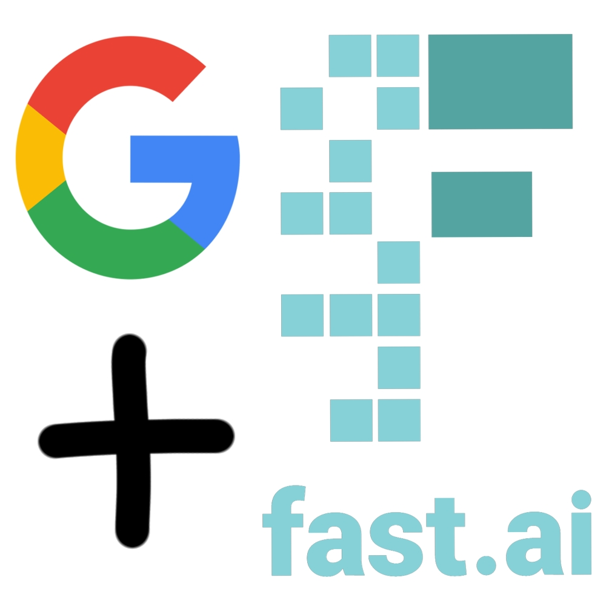

One year ago, I tried to learn Machine Learning. I failed.

I bounced around from course to course, got confused about what I should really be learning, and failed to accomplish any of my goals.

This time, I'll be focusing on only two different resources and using several systems and learning strategies to keep myself on track.

So why am I going to succeed this time?

## What is Machine Learning?

That is a *difficult* question to answer in a way that wouldn't take over this entire post. For that reason, I won't be answering that question in this article, but I've linked others that have [explained](https://cloud.google.com/learn/artificial-intelligence-vs-machine-learning) common [concepts](https://developers.google.com/machine-learning/glossary/fundamentals?hl=en#machine-learning) much more [succinctly](https://docs.google.com/viewer?a=v&pid=sites&srcid=dnRzaC50Yy5lZHUudHd8d2VpLWRhby16aG9uZy14dWUtY2hlbmctc2hpLWppbmcteWluZy1iYW58Z3g6MjEzNDc3NGU0ZTM4YWYxMw) than I could have done here. 

In a sentence, Machine Learning(ML) is using certain algorithms, called models, to solve a problem using data.

If you would like to see a blog post explaining Machine Learning, AI, Deep Learning, and other commonly confused concepts in depth, leave a comment below.

## Goals
To begin with, let's create a distinction between two ways of *"learning ML"*:
- ML Researcher: Explores what can be **understood** *about* ML.
- ML Engineer: Explores what can be **made** *with* ML.

My current goal, to create thought-provoking/funny/insightful projects using existing tools, falls more on the engineering side of this division.

I find the inner workings of ML models deeply fascinating, and eventually want to transition to research. For now though, I want to be able to understand and use Machine Learning models to *make* things.

With goals clarified, let's jump into last year's failures.

## Lessons from Last Year

Looking back on last year, I see that I failed to learn Machine Learning because of one main reason:

### Bottom-up Learning
Bottom-up learning is the idea that if you are learning a complex subject, then you should break it down, learn it one piece at a time, and not progress to the next piece until you've mastered it. If you were using bottom-up learning for mathematics, then you would start with algebra 1, then move on to geometry, the algebra 2, precalculus, maybe some extra trigonometry, and finally, calculus.

The rational behind this approach to learning is that it provides a solid foundation of mastery on which to build off of. This is the approach used in schools, especially for mathematics, and is often thought of as the only way to learn.

The problems with it?

Bottom-up learning reinforces an attitude of black and white. A problem is either an algebra problem or a geometry problem. In reality, hard problems often need a multi-faceted approach to be solved. This leaves those that took this approach unprepared when they are in a position where creativity is required to solve the problem at hand.

Because bottom-up learning is concerned with mastering only one tiny part at a time, it is forced to create practice problems that artificially cater to that one tiny facet. Consider the practice problems used by math courses to help students "master" a facet of geometry.

Rather than being asked to prove the pythagorean theorem, which would require creative applications and mixings of geometry, trigonometry, and algebra, students are told to find the missing angle measure of a triangle using a force-fed formula. After a single problem, every student's eyes will glaze over as they attempt to speed through the mind-numbing, 50 question assignment meant to help them "master" said formula.

This leads to the biggest problem with bottom-up learning: It is ***SO DAMN BORING.*** Because you're trying to master every individual element of the subject, it takes forever, leads to a feeling of never being prepared to solve real-life problems, and causes resentment at the thousands of unnecessary practice problems that ultimately gave them nothing.

How many AP Calculus students would be able to prove a basic theorem? I would bet maybe 1 in 1000, if that. And yet, they spent multiple years advancing through all the prerequisite math classes. Many students don't even make it to precalculus, let alone calculus, due to burnout from the terrible way that math was taught to them.

If this mini-rant was intriguing, the *phenomenal* article ["A Mathematician's Lament" by Paul Lockhart](https://www.maa.org/external_archive/devlin/LockhartsLament.pdf) describes the present situation nicely. I highly recommend checking it out!

### A Trap Fallen For
This approach to learning is what made me fail last year.

Bottom-up learning made me try to juggle multiple courses because I would want to cover the same topic in different resources that I was using. I was so scared of not building up a solid "foundation" that I got stuck in a self-created quagmire of resources.

Bottom-up learning scared me off from attempting to tackle real challenges, because I never thought my "foundation" was good enough. I wouldn't even know how to begin on a project, because I had so many different approaches to solving the same problem that I could never decide which one to use.

This is not to say that jumping in to projects head-first without any baseline knowledge is a good idea. While there are some that can deal with having to learn everything through trial and error, many become overwhelmed with the lack of any knowledge on how to begin.

So how will I effectively balance complete lack of general knowledge with the pitfalls of approach paralysis?

## Plan
This year, I'm cutting all the different overlapping resources in favor of just two:
1. Google's Foundational ML Courses
2. Fast.ai's Practical Deep Learning for Coders

Why these two? 

Google's series of courses are oriented towards applicable ML and data science skills, with courses like *Problem Framing* and *Testing and Debugging*. I'm hoping that these application focused courses will help cut any fluff, and give me the necessary skills to prepare data and effectively use ML.

While Google's courses are focused on the fundamentals of using ML such as data sourcing and preparation, basic model use, and pipeline testing, fast.ai's course will help get me up to speed with the subfield of Deep Learning(DL), one of the most powerful areas of Machine Learning. It will mostly be the more complex models of DL that will let me solve difficult problems efficiently, which is why this course will be invaluable.

Limiting my courses to only these two will give me a good amount of general knowledge about ML that I can apply to future projects, while making sure I don't get paralyzed by uncertainty when beginning a real project.

I'm setting a deadline of ***Nov. 30, 2023*** for finishing both these courses. After that, I need to start real, original projects to fully master what I will have learned from the courses. 

## The End?
Nope.

This is just the beginning.

Once I've finished the two courses, I'll post a new article about what went wrong, what went right, and what my plan is for the next phase of learning ML. If all goes to plan, then you can expect that post around the end of November. Until then, I'll be working my hardest while trying to balance this project with the rest of my life.

Wish me luck.